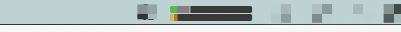

# ClaudeUsageBar

A macOS menubar app that displays your Claude API usage as two small bars.



## Bars

- **Top bar** — 5-hour session window
- **Bottom bar** — 7-day weekly window

Each bar shows a thin vertical marker at the current time position within the window.

## Colors

- **Green** — usage is on track (at or below the time-elapsed proportion)
- **Yellow / dark yellow** — usage is over budget (yellow up to the time marker, dark yellow for the excess beyond it)
- **Gray** — time elapsed portion (visible behind green when on track)
- **Dark background** — remaining time in the window
- **Red** — error fetching usage data

## Prerequisites

- macOS 13+
- Swift 5.9+
- An active Claude Code session (the app reads OAuth credentials from the `Claude Code-credentials` keychain entry)

## Build & Run

```
make run
```

This builds a release binary, bundles it into `ClaudeUsageBar.app`, and opens it.

Other targets:

```
make build    # compile only
make bundle   # compile + create .app bundle
make clean    # remove build artifacts
```
